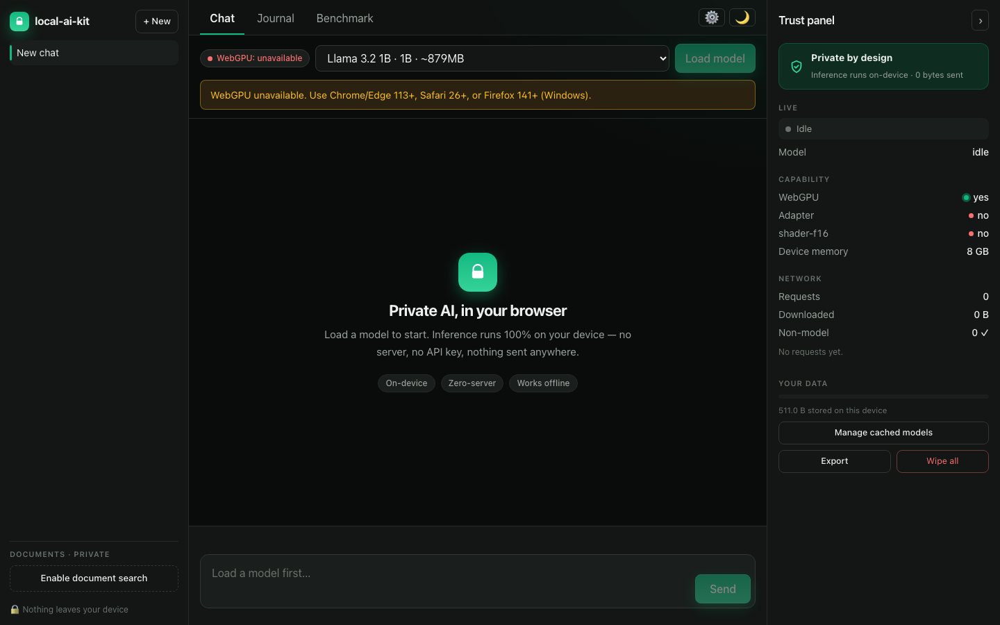

# local-ai-kit

**A private AI workspace that runs entirely in your browser tab.** Chat, chat
with your documents, and reflect on a private journal — powered by an LLM that
runs 100% on your device via [WebLLM](https://github.com/mlc-ai/web-llm) +
WebGPU. No server, no API keys, nothing ever leaves your machine. Turn off your
wifi and it still works.



---

## Why it exists

Every "AI app" sends your prompts to someone's server. This one doesn't — and
proves it. Inference, embeddings, retrieval, and your entire corpus stay
on-device. The built-in **Trust panel** shows a live network monitor: during
generation, **0 bytes are sent**.

### The pitch, in code

It speaks the OpenAI SDK's shape — swap the import, delete your inference bill:

```ts
// Before — OpenAI cloud
import OpenAI from "openai";
const client = new OpenAI({ apiKey });
const res = await client.chat.completions.create({ model, messages, stream: true });

// After — local, in the browser (no key, no server)
import { LocalAI } from "local-ai-kit";
const client = new LocalAI();
await client.load("Llama-3.2-3B-Instruct-q4f16_1-MLC"); // downloads once, then cached
const res = await client.chat.completions.create({ messages, stream: true });
```

> Same `chat.completions.create` shape; model selection moves to `load()` (WebLLM
> ignores the request `model` field). Streaming + JSON mode are genuine drop-ins;
> tool-calling is still WIP upstream.

## Features

- 🔒 **100% on-device** — WebLLM + WebGPU inference in a Web Worker; the Trust
  panel proves zero network during generation
- 💬 **Chat** — streaming, markdown/code, stop / regenerate / copy, context meter
- 📄 **Chat with your docs (RAG)** — drop in `.txt` / `.md` / `.pdf`, embedded
  locally into an IndexedDB vector store, answered with citations
- 📓 **Private journal + reflection** — entries join the same corpus; one-click
  "reflect on my themes" over everything you've written
- 🧠 **Reasoning traces** — collapsible chain-of-thought (DeepSeek-R1)
- 👁 **Vision** — attach an image and ask about it (Phi-3.5-vision)
- 📊 **Benchmark** — measure TTFT + prefill/decode tok/s on *your* GPU
- 🗄 **Data ownership** — export everything, wipe all local data, manage cached
  model weights, live storage meter
- ⌘K **command palette**, light/dark theme, installable **offline PWA**

## How it works

```
Main thread (React 19)                Web Worker
┌───────────────────────┐  postMessage  ┌────────────────────┐
│ UI · Trust panel      │◄────────────►│ WebLLM engine      │
│ OpenAI-shaped facade  │              │ (WebGPU inference)  │
└───────────┬───────────┘              └────────────────────┘
            │ IndexedDB (chats · journal · vectors) + Cache API (weights)
```

- **WebLLM + Apache TVM/MLC** compile models to WebGPU kernels; runs in a worker
  so the UI stays at 60fps.
- **Capability detection** requests a real WebGPU adapter (presence of
  `navigator.gpu` alone isn't enough) and picks a model tier for the device.
- **RAG** uses a small on-device embedding model (Snowflake Arctic-embed) + an
  IndexedDB vector store with cosine search.
- **Offline PWA** precaches the shell; model weights are cached on first load.

### Model tiers

| Tier | Example | ~VRAM | Feel (M1) |
|---|---|---|---|
| Instant | Llama 3.2 1B | ~0.9 GB | ~42 tok/s |
| Balanced (default) | Llama 3.2 3B | ~2.3 GB | smooth |
| Max (opt-in) | Llama 3.1 8B / Qwen 7B | ~5 GB | usable |

The live catalog also includes Phi-3.5-vision and DeepSeek-R1-Distill.

## Browser support

Needs **WebGPU**: Chrome/Edge 113+, Safari 26+ (incl. iOS), Firefox 141+
(Windows). Where it's absent, the app detects it and shows a clear fallback.

## Honest tradeoffs

- First load downloads model weights (hundreds of MB–GBs) — once, then cached.
- In-browser WebGPU is slower than native GPU backends; prefill is the bottleneck.
- Local models are smaller than frontier cloud models — great for private,
  everyday tasks, not a GPT-5 replacement.
- Mobile has tighter memory limits; stick to Tier 0/1 there.

## Getting started

```bash
pnpm install
pnpm dev        # http://localhost:5173
```

Open in a WebGPU browser → pick a model → **Load model** → chat.

## Scripts

| Command | What |
|---|---|
| `pnpm dev` | Dev server |
| `pnpm build` | Typecheck + production build |
| `pnpm lint` | ESLint |
| `pnpm typecheck` | `tsc --noEmit` |
| `pnpm test` | Vitest unit + integration |
| `pnpm test:e2e` | Playwright end-to-end |

### Testing

- **Unit + integration** (Vitest + Testing Library) cover the pure logic
  (capability tiers, model resolution, chunking, cosine search, reasoning split)
  and components (messages, docs panel, command palette).
- **E2E** (Playwright) covers UI + the no-WebGPU fallback. A gated inference
  smoke test runs full end-to-end only against a WebGPU-capable browser
  (Chromium exposes no adapter under automation, so it self-skips in CI).

## Tech stack

React 19 · TypeScript (strict) · Vite · Tailwind v4 · WebLLM · pdf.js · idb ·
Vitest + Testing Library · Playwright · PWA.

## Privacy

"Private" means **no inference-time data leaves the device**. Model weights are
downloaded from a public CDN on first load (visible in the Trust panel); after
that the app works fully offline. There is no analytics and no backend.

## License

MIT
